# 主题: 企业云原生实践

摘要:
在开发与运维人员的角度如何保证开发的敏捷应用程序的创建和部署的效率及可靠的硬件管理高可用成为了运营成本的重大投入; 在容器化管理之前,往往在应用开发与生产版本的运行时的不一致及移植业务割接工作都需要大量的开发运维工作量; 在容器化后解决了持续开发、集成和部署,通过快速简单的回滚(由于镜像不可变性)，提供可靠且频繁的容器镜像构建和部署; 并使得开发与运维的分离,在构建/发布时而不是在部署时创建应用程序容器镜像，从而将应用程序与基础架构分离; 可观察性不仅可以显示操作系统级别的信息和指标，还可以显示应用程序的运行状况和其他指标信号。对于容器管理,网络服务,资源管理等问题上基于kubernetes的架构二次开发云产品成为了企业的降本增效,快速支撑业务的首要目标; 在整体设计上,基于命名空间为环境,将用户分为管理用户,开发用户的不同操作视觉的维度; 对于运维用户更多的是做机器管理,命名空间资源配额(包括绑定node/绑定存储类/资源限定),存储管理等工作; 对于开发用户,更需要关注的是如何实现持续集成,快速上线,持续部署等工作;

## 1. Tekton 流水线的持续交付

### 背景

我们通常的开发流程是在本地开发完成应用之后，使用git或svn作为版本管理工具，将本地代码提交到类似版本管理仓库中做源代码持久化存储; 然而来自多个仓库涉及到多个中间件作为底层依赖一起部署到生产环境中时，大部份公司内部通常会有持继集成流程; 早期使用Jenkins工具链完成当下持续集成的工作流程,解决上层devops流程中的必要环节,但使用jenkins由master-slave的架构加之使用jvm运行及其内部使用DSL(groovy)拓展,对于服务器资源使用率,拓展性都不太理想;

### 提出问题

那么如何解决可以快速拓展及拥有强大调度能力框架及架构可以支持千量级并发持续集成的方案? 答案是肯定的，而且不乏竞争者，业内知名的有knavtieBuild/Jenkins/JenkinsX/Spinnaker/ArgoCD/Tekton，其中tekon凭借其众多优良特性在一众竞争者中胜出，成为领域内的事实标准, 我们公司在实践云原生的道路上的第一站,基于Tekton框架的高阶实现;

### 如何解决

有这么多的构建工具，我们为什么会选择它呢？

Tekton是Kubernetes原生的应用发布框架，主要用来构建 CI/CD 系统。它原本是 knative 项目里面一个叫做 build-pipeline 的子项目，用来作为 knative-build 的下一代引擎。然而，随着 k8s 社区里各种各样的需求涌入，这个子项目慢慢成长为一个通用的框架，能够提供灵活强大的能力去做基于 Kubernetes 的构建发布。

| x | jenkins-x | Spinnaker | Argo | Tekton |
| :-----| :-----| ----: | :----: | :----: |
| 云原声 | ✔︎ | x | ✔ | ✔︎ |
| 灵活的扩展 | x | x | x | ✔︎ |
| 轻量化 | x | x | ✔ | ✔︎ |

针对上面的表格详细叙述一下Tekton的优势:

- 标准化 CI/CD 工具
  - Tekton 是一个强大且灵活的 Kubernetes 原生开源框架，可用于创建持续集成和交付 (CI/CD) 系统。该框架可让您跨多个云服务商或本地系统进行构建、测试和部署，而无需操心基础实现详情。
- 针对 Kubernetes 的内置最佳做法
  - Tekton 提供开源组件来帮助您标准化 CI/CD 工具和适用于不同供应商、语言和部署环境的流程。Tekton 提供的流水线、版本、工作流和其他 CI/CD 组件所遵循的行业规范可很好地适用于 Jenkins、Jenkins X、Skaffold、Knative 和其他现有的 CI/CD 工具。

- 在混合环境或多云端环境运行
  - Tekton 可让您跨多个环境（例如虚拟机、无服务器、Kubernetes 或 Firebase）进行构建、测试和部署。您还可以使用 Tekton 流水线跨多个云服务商或混合环境进行部署。

- 获得极大的灵活性
  - Tekton 可赋予您充分的灵活性，让您可以使用您喜欢的 CI/CD 工具创建强大的流水线。Tekton 让您无需操心基础实现，只需根据团队的要求选择构建、测试和部署工作流即可。


正是因为tekton的令扩可扩展性,我们基于tekton实现了我们的容器云，以tekton作为我们CI的数据平面，容器云作为我们的控制平面，我们设计了以下的主要模块。
- pipeline模块
- pipelinerun模块
- webhook模块
- 构建模板商店模块

pipeline的模块，我们的为了让用户的更简单的操作，我们以`low-code`的方式去实现,更贴切用户的操作下的习惯，用户可以在Tekton的下面的pipeline动手画自己的pipeline，每个pipeline由N个Task组成，形成一个DAG。这里说的到的pipeline和task的概念都是来自tekton。task和pipeline都属于Kubernetes的自定义资源。正因为Kubernetes是声明式的，所以你可以自由的编排你的task和pipeline。

#### pipeline模块
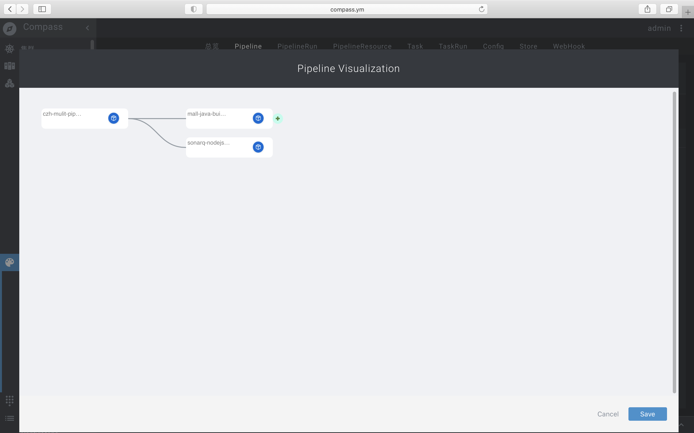
可以看到上图的pipeline的dailog,用户可以动态增加task和删除task，这种操作就是所谓的`low-code`

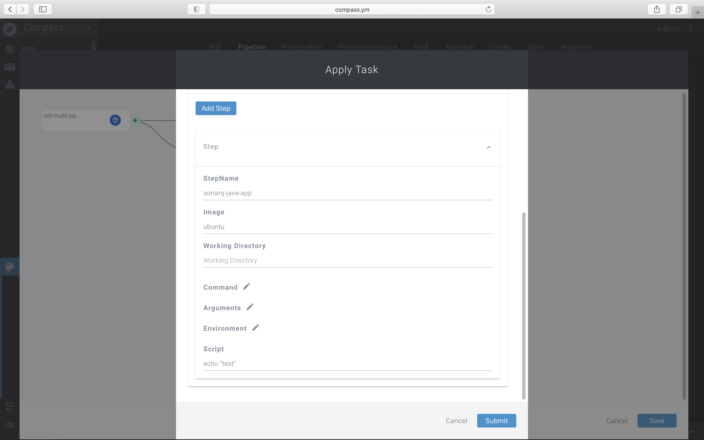
当我们点击节点(task)的时候，这个时候我们就需要针对这个task去编辑，这个task的意思就是，你要这个task(任务)做什么事情，比如上图的task，就是简单的打印一下`test`，当我们编辑完所有的task的时候，我们保存好这个pipeline，然后跑一个pipelinerun实例出来。


#### pipelinerun模块
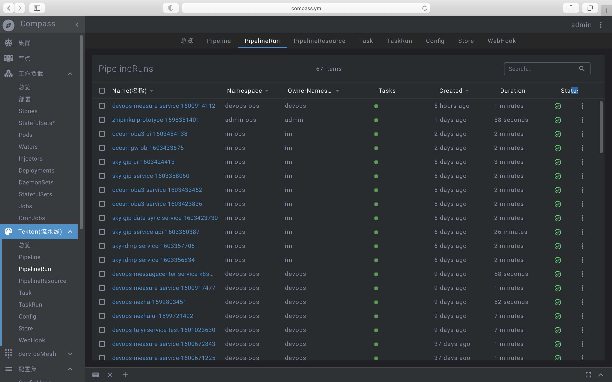
这里就是我们把每个pipeline跑出来的实例，每条pipeline-run都可以看到所在的租户下面的pipelinerun，有多少个任务，创建的时间是什么时候，执行的耗时是多少，状态是什么？

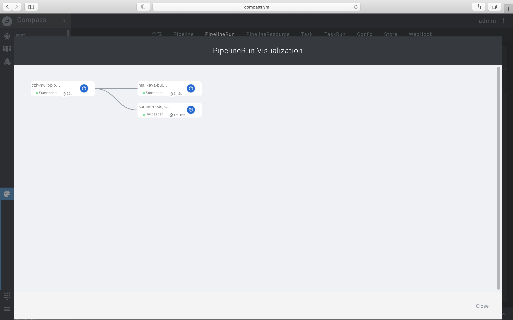
点击pipeline的名称的时候，弹出一个dialog，这里可以显示每个task的一些状态，比如这个task是成功的还是失败的，时间是多长，叫什么名字。


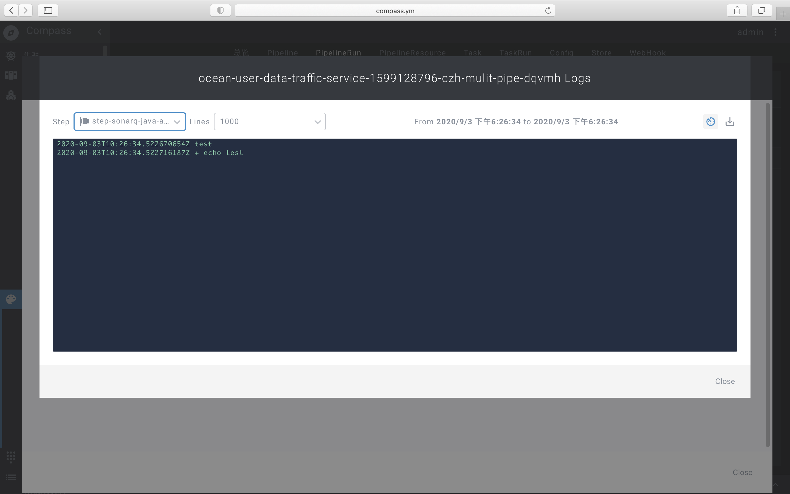
当我们点击task的时候，就是可以看到其的构建日志，也就是刚才我们的打印一个`test`.


#### 构建模板商店模块

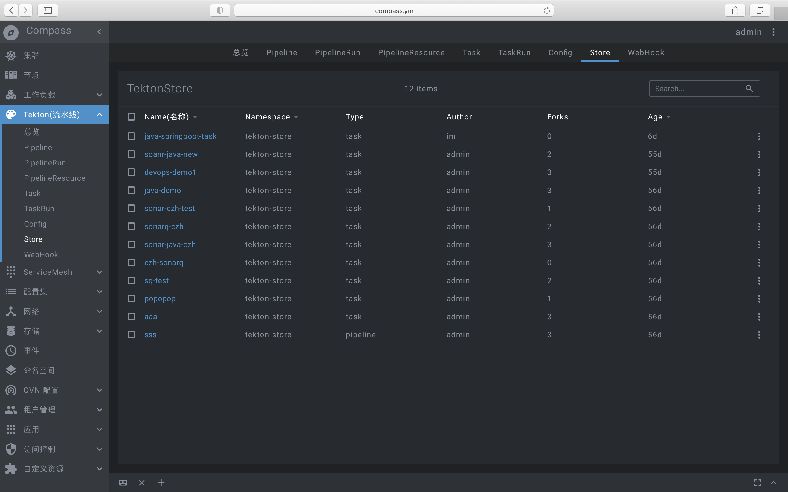

上图就是我们的构建模板商店模块，构建模板商店模块的作用就是每个用户都可以上传它定义的资源，比如task和pipeline等，这些模版都是可以复用的，想用的用户就可以在里面下载。


#### webhook模块


以上就是我们的webhook模块，它的作用就是配合github/gitea/gitlab的webhook操作，当一个pr或者mr提交的时候，通过webhook出发ci的构建，实现动态化，取代手动创建pipeline的创建。


最后，这就是我们目前的实现的版本，要实现更加的自动化，比如chatOps,GitOps等，真是任重而道远，CI这块还有很长的道路要走，我们需要更加的方便用户的操作，以用户的操作方便性为中心，省时省力，去构建我们的CI/CD.


### 其他(延伸点)
...

## 2. 自定义CRD增强部署管理

### 背景

当前我们在持续集成后的应用采用2种部署在物理机或者vm上(后统称node),docker化部署及传统裸机/vm(supervisor管理)部署在这些node上; 在运维人员的角度考虑如何做到高可用,负载均衡等基础资源架构; 需要借助大量的第三方工具链实现拓展; 其次这种组织在node架构上运行应用程序。对于运行node架构中的应用对于运维人员角度来看,比较难定义资源边界，这会导致资源分配问题。例如在node原本的基础上运行多个应用程序，则可能会出现一个应用程序占用大部分资源的情况，结果可能导致其他应用程序的性能下降。一种解决方案是在不同的node上运行每个应用程序，但是由于资源利用不足而无法扩展，管理的成本很高。

### 提出问题

* 问题1: 为了解决高可用问题,如何让应用部署可以感知地理位置感知并预先发布在每个不同机架的节点上防止机架掉电,机架网络交换机宕机等问题

* 问题2 如何解决更新应用的速度,大批量更新时的node的资源创建导致抖动

* 问题3 如何做到灵活的策略部署,并支持组的方式管理新旧版本实现蓝绿,金丝雀发布

### 如何解决

问题1 解决方案: 我们站在运维的角度思考,需要考虑真实机房机架安装服务器的供电,网络交换机的安装背景,还包括分布式存储的部署网络等情况等因素,解决应用部署至少需要实现不同机架的物理机冗余副本的高可用方式; 对此考虑,每个计算节点应当有地理信息,那么集群内的节点都需要运维人员进行添加与配置标识相应的区域,机架号,节点名称作为拓扑信息,应用发布时可以策略控制预先考虑在不同的机架机器上部署多副本,如图中对node的地理信息标识

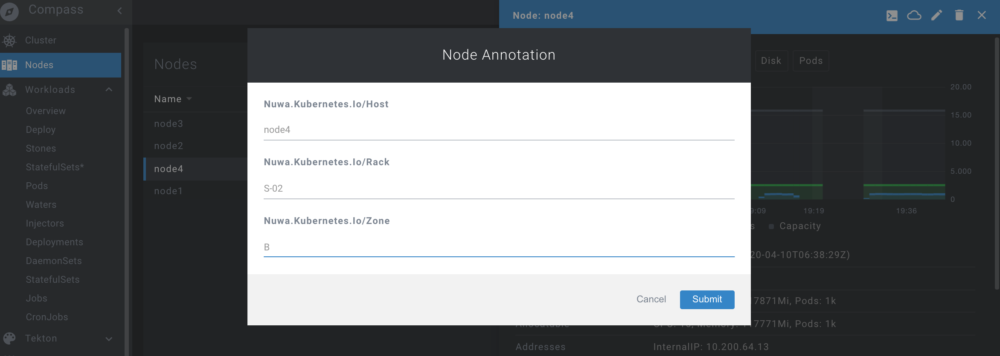

基于节点的地理信息标识,运维人员可以在创建命名空间绑定一批节点作为一个环境分配予开发用户(租户),此命名空间下发布的所有运行资源将会被调度在这批节点上
  
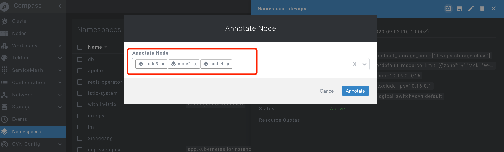

对于划分环境的方式使用命名空间方式,有状态副本集使用存储也是属于运维人员的范畴,所以在命名空间的维度可以配置存储类

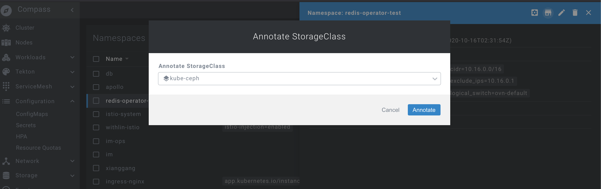

运维人员还可以根据申请配置命名空间进行精细的资源限定

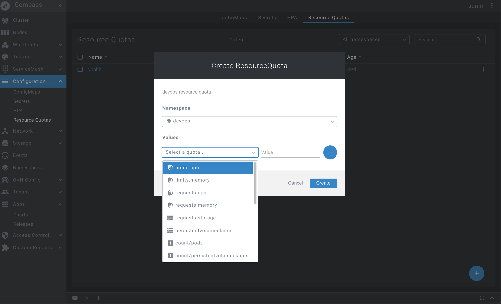

问题2 解决方案: kubernetes原生工作负载,不论是deployment、statefulset还是pod本身,如果你想升级pod中的镜像,那么kubernetes就会重新销毁该pod并重新调度并创建一个pod,对于statefulset虽然可以保持原有pod的名字,但是实际UID及pod的ip都将发生改变。如果你还使用了istio,那么在更新sidecar容器的时候,所有植入sidecar容器的pod都需要销毁、重新调度和重建,这将带来极大的开销,同时也影响了业务的稳定性。所以需要重新实现基于原生的控制器实现的一种资源控制器,可以在资源更新的时候实现原地升级(in-place update), 这种升级方式可以更新pod中某一个或多个容器的镜像版本,而不影响pod中其余容器的运行，同时保持pod的网络和存储状态不变。

问题3 解决方案: 资源控制器基于组的概念来解决发布时的应用的形态,我们内部实践设定了四种策略的方式:

* alpha: 挑选其中一组的一个发布1个pod,初次发布的应用尝试发布能否创建成功

* beta: 挑选(多组/一组)的一个发布1个pod,初次发布的应用尝试发布在每个组内(每个组可能在的机房/区域不同)能否创建成功

* omega: 挑选多组的每个机器上发布1个pod

* release: 全量发布

部署的布局如下图:

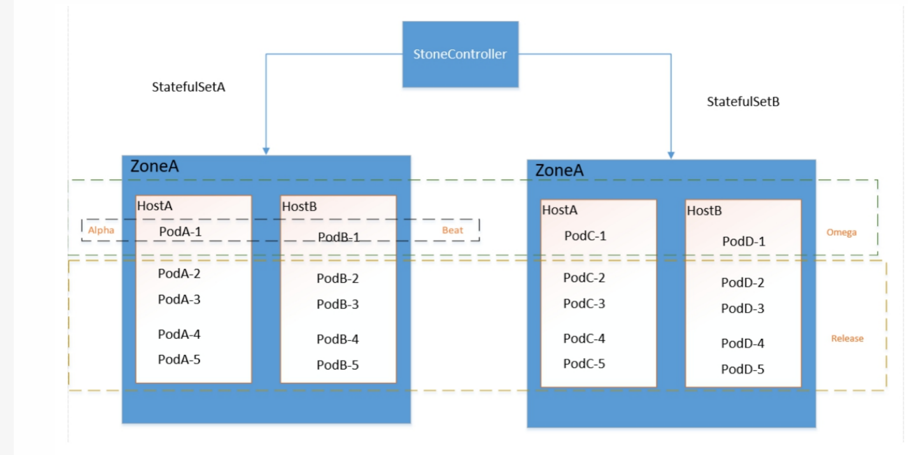

更新操作如下图:

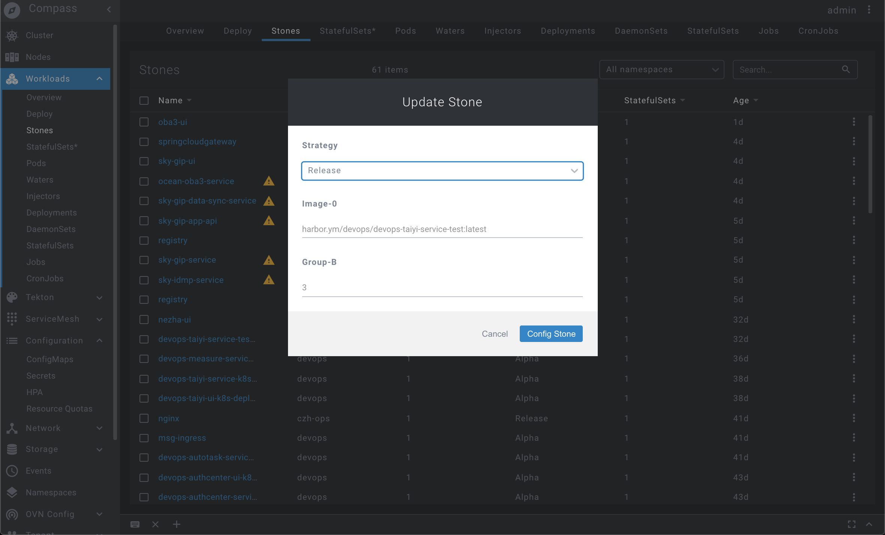


### 其他(延伸点)

对于资源控制器的要求将会在以后越来越多的业务场景,将会有更多新的基于kubernetes crd实现的控制器出现; 包括一些数据库应用的管理方式: 例如Mysql的集群架构,主从架构,或者Tidb,Mongodb等分布式的数据库,消息中间件等,后续需实现相应的专用的控制器;

## 3. 云原生下的运维管理(管理工具)


### 背景

通常我们一般在开发环境或者测试环境，遇到应用的网络不通，内存泄露，cpu飙升等，需要调试k8s里面的pod的业务容器，并且容器技术的一个最佳实践是构建尽可能精简的容器镜像。但这一实践却会给排查问题带来麻烦：精简后的容器中普遍缺失常用的排障工具，每次进去都需要（apt-get）去下载一些工具，给我们带来了极大的不便利性，甚至把基础镜像打的很大,导致在镜像不好传输等，为了让用户更方便的调试又精简容器的大小，我们需要在容器云推出一个很好的调试工具。

### 提出问题

那么针对上面的背景,我们需要这精简的容器并且又不需要安装其他命令的情况下，怎么去把这块的调试功能做好呢？

### 如何解决

在我们容器云平台里面，我们支持web-shell的功能,点击pod的时候，通过web-shell的方式进入容器里面,让用户针对它自己的业务容器排错，本身原理是非常简单的，如果理解了原理那么就能知道它是如何实现和如何使用的。

在讲这个运维工具之前，我们需要了解一下docker的基本原理，k8s是站在docker之上的，本质运行的还是docker，docker的本质是基于namespace隔离和cgroup资源限制，倘若，我们启动一个进程加入目标容器的namespace中，这样子就和目标容器共享namespace了，那么共享了namespace会怎么样呢？就能看到了目标容器的进程，网络，挂在的目录等。

如果进入了目标容器又能和它共享namespace的同时我们带入一些调试工具，比如网络的排查的image（netshuoot),当目标容器出现了网络的问题，那么就可以针对这个image进去调试网络故障的问题，因为这个工具几乎包含了所有的网络故障排查工具。那么在k8s里面我们是怎么做的呢？

详细的实现流程如下：
- 提前在所有的node安装一个Daemonset，其职责负责attach到目标容器的namespace，并且和后台简历SPDY连接
- 查询目标Pod在哪个节点上
- 找到所在的节点的Pod的节点，并且找到改pod的容器，发送指令给Daemonset的程序，并且attach到目标容器里面
- 用户排查问题

知道了原理和对应的流程之后，就很很容易的使用我们compass容器云来进行排查问题了，在我们的容器云里面找到你要调试的pod，点击当前的Pod，然后进行选择对应的容器进行debug操作,容器云的前端采用[socketjs](https://github.com/sockjs/sockjs-client)和微软的[xterm](https://github.com/xtermjs/xterm.js/)来进行整体的交互，`socketjs`用来
管理底层的websocket连接，而`xterm`用在web上的终端,在容器云上很方便用户的操作。

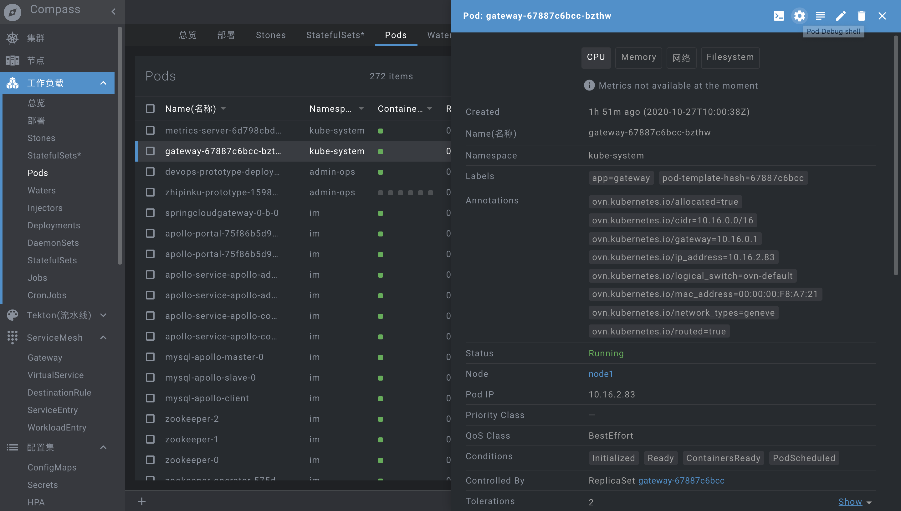
> 右上角有个齿轮的东西点击就可以进入调试

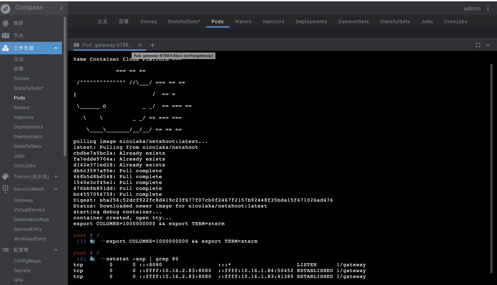
> 可以看到，当我们attach到容器里面的，执行了netstat命令，由于一些极简的镜像什么东西都没有的
>
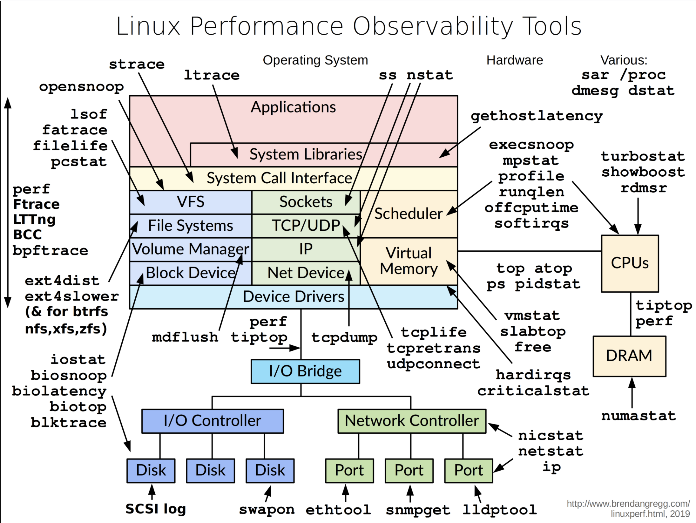

[netshoot](https://github.com/nicolaka/netshoot)包含了如上的工具，这样子我们想调试目标容器都是这么轻而易举的。

为了制造一些方便开发使用的运维工具的时候，我们又要考虑到业务容器的镜像的极简性(足够小)，于此同时萌发了我们的思考，所以才造就我们开发了这个调试工具,后面，我们需要接入更多的业务团队，由于我们公司的多语言技术栈，比如java,php,golang，python,不同的语言栈，会出现不同的工具，后续，我们针对不同的语言做不同的工具集，方便业务团队使用，比如java应用的内存泄露，cpu飙升，我们会在基础的image装载一些类似[alibab-arthas](https://github.com/alibaba/arthas)等，每个image只做一件事情的原则。

### 其他(延伸点)

用Daemonset的这种方式有点不太优雅，还有优雅的方式当然是 kubernetes的[临时容器](https://kubernetes.io/zh/docs/concepts/workloads/pods/ephemeral-containers/)的方案，但是此方案还是alpha版本，处于比较多bug阶段。这里我讲讲它是怎么比较优雅呢？

详细的原理如下：

- 临时容器其实在原生的Pod扩展了临时容器
- 临时容器是一份是一份CRD(CustomResourceDefinition),用户自定定于

  ```text
  {
    "apiVersion": "v1",
    "kind": "EphemeralContainers",
    "metadata": {
            "name": "nginx-6db489d4b7-tvgsm"
    },
    "ephemeralContainers": [{
        "command": [
            "sh"
        ],
        "image": "busybox:latest",
        "imagePullPolicy": "IfNotPresent",
        "name": "debugger",
        "stdin": true,
        "tty": true,
        "terminationMessagePolicy": "File"
    }]
  }
  ```
- 在原生的Pod字段加入这份JSON，那么原生的Pod就具备了一个调试功能，因为相同的Pod之间的容器本质也是类似我们前面说到共享namespace的，所以我们可以直接attch到这个容器里面做做我们想做的调试功能，只是把相关的image替换成我们各种工具的image。

最后但同样重要的是这是google的开发者推从的方案，也是kubernetes后面发展的趋势，所以我们应该跟随者kubernetes的发展，而不是独立出自称一个派系。


## 4. 服务网格的实践

### 背景

...

### 提出问题

...

### 如何解决

...

### 其他(延伸点)

...
