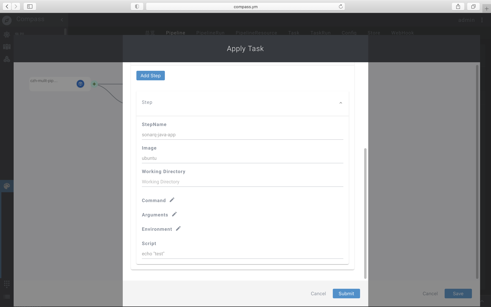
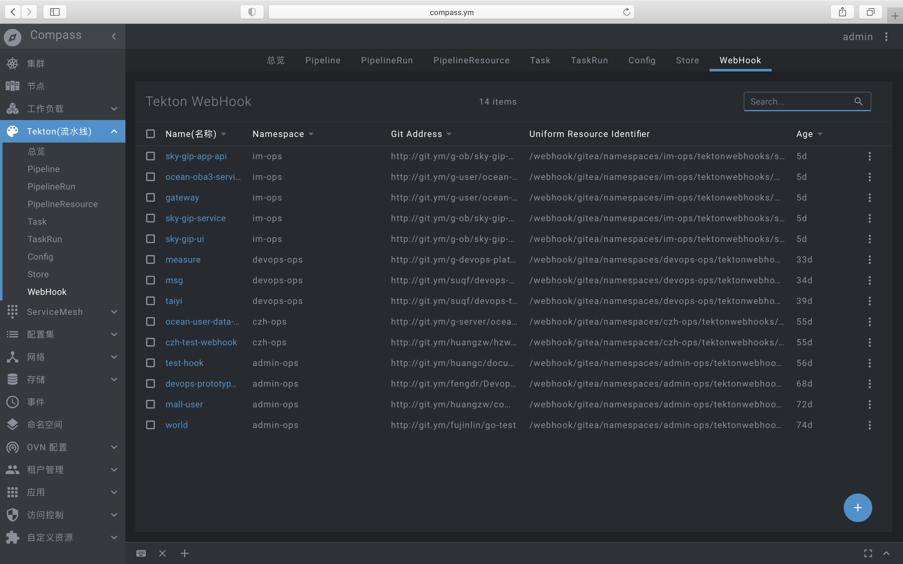

# 主题: 企业云原生实践

## 如何在企业里实践云原生(Cloud Native)? 首先我们来了解下云原生的发展史

最初云原生定义最初由Pivotal公司提出，最初的时候定义为云原生架构中应具备以下几个主要特征:
* 符合12因素应用
* 面向微服务架构
* 自服务敏捷架构
* 基于API的协作
* 抗脆弱性

后来到了2015年Google主导成立了云原生计算基金会（CNCF，起初CNCF对云原生（Cloud Native）的定义包含以下三个方面:
* 应用容器化
* 面向微服务架构
* 应用支持容器的编排调度

到了2018年，随着近几年来云原生生态的不断壮大，所有主流云计算供应商都加入了该基金会，且从Cloud Native Landscape中可以看出云原生有意蚕食原先非云原生应用的部分。CNCF基金会中的会员以及容纳的项目越来越多，该定义已经限制了云原生生态的发展，CNCF为云原生进行了重新定位。

* 云原生技术有利于各组织在公有云、私有云和混合云等新型动态环境中，构建和运行可弹性扩展的应用。云原生的代表技术包括容器、服务网格、微服务、不可变基础设施和声明式API
* 这些技术能够构建容错性好、易于管理和便于观察的松耦合系统。结合可靠的自动化手段，云原生技术使工程师能够轻松地对系统作出频繁和可预测的重大变更。
* 云原生计算基金会（CNCF）致力于培育和维护一个厂商中立的开源生态系统，来推广云原生技术。我们通过将最前沿的模式民主化，让这些创新为大众所用。

## 基于以上特性的定义，在企业内实践如何做到以下四点?
* 如何构建可靠的持续集成?
* 可靠的持续部署如何设计与实践?
* 如何解决云原生架构上的运维运营? 
* 如何解决业务流量动态变化大与上线迭代速度快的问题?

## 背景与设计
如何构造不可变的基础设施改造:

在企业里，开发与运维人员的角度如何保证开发的敏捷应用程序的创建和部署的效率及可靠的硬件管理高可用成为了运营成本的重大投入，在容器化管理之前，往往在应用开发与生产版本的运行时的不一致及移植业务割接工作都需要大量的开发运维工作量; 在容器化后解决了持续开发、集成和部署，通过快速简单的回滚(由于镜像不可变性)，提供可靠且频繁的容器镜像构建和部署; 并使得开发与运维的分离，在构建/发布时而不是在部署时创建应用程序容器镜像，从而将应用程序与基础架构分离; 可观察性不仅可以显示操作系统级别的信息和指标，还可以显示应用程序的运行状况和其他指标信号。

运营运维管理的思考:

能让每个部门或者业务线作为租户的方式管理，资源配额，权限管理，快速支撑业务的首要目标。在整体设计上，可以实现自定义环境，可以管理区域内机架机器，做到至少有高可用的架构，包括运行时可观察监测。为此使用kubernetes架构进行二次开发云产品成为了企业的以上目标的首选方案，采用基于命名空间的逻辑定义为运行环境，将用户分为管理用户，开发用户的不同租户，各自关注不同操作维度。运维用户更多的是做机器管理，命名空间资源配额(包括绑定node/绑定存储类/资源限定)，存储管理等工作。对于开发用户，更多的是关注的是如何实现持续集成，快速上线，持续部署等工作。

## 实践1持续集成的流水线

我们通常的开发流程是在本地开发完成应用之后，使用git或svn作为版本管理工具，将本地代码提交到类似版本管理仓库中做源代码持久化存储。 然而来自多个仓库涉及到多个中间件作为底层依赖一起部署到生产环境中时，大部份公司内部通常会有持继集成流程; 早期使用Jenkins工具链完成当下持续集成的工作流程，解决上层devops流程中的必要环节，但使用Jenkins由master-slave的架构加之使用jvm运行及其内部使用DSL(groovy)拓展，对于服务器资源使用率，拓展性都不太理想。

那么如何以云原生的方式解决可以快速拓展及拥有强大调度能力框架及架构可以支持千量级并发持续集成的方案? 有没有现成的方案能快速且廉价的改造就可以实现? 答案是肯定的，而且不乏竞争者，业内知名的有Knavtie-Build/Jenkins/JenkinsX/Spinnaker/ArgoCD/Tekton，其中tekon凭借其众多优良特性在一众竞争者中胜出，成为领域内的事实标准，有这么多的构建工具，我们为什么会选择它呢？Tekton是Kubernetes原生的应用发布框架，主要用来构建 CI/CD 系统。它原本是 knative 项目里面一个叫做 build-pipeline 的子项目，用来作为Knavtie-Build的下一代引擎。然而，随着Kubernetes社区里各种各样的需求涌入，这个子项目慢慢成长为一个通用的框架，能够提供灵活强大的能力去做基于Kubernetes的构建发布。我们公司在实践云原生的道路上的第一站，基于Tekton框架的高阶实现。

| 产品 | JenkinsX | Spinnaker | Argo | Tekton |
| :-----| :-----| ----: | :----: | :----: |
| 云原声 | ✔︎ | x | ✔ | ✔︎ |
| 灵活性 | x | x | x | ✔︎ |
| 轻量化 | x | x | ✔ | ✔︎ |

针对上面的表格详细叙述一下Tekton的优势:

- 标准化 CI/CD 工具
  - Tekton 是一个强大且灵活的 Kubernetes 原生开源框架，可用于创建持续集成和交付 (CI/CD) 系统。该框架可让您跨多个云服务商或本地系统进行构建、测试和部署，而无需操心基础实现详情。

- 针对 Kubernetes 的内置最佳做法
  - Tekton 提供开源组件来帮助您标准化 CI/CD 工具和适用于不同供应商、语言和部署环境的流程。Tekton 提供的流水线、版本、工作流和其他 CI/CD 组件所遵循的行业规范可很好地适用于 Jenkins、Jenkins X、Skaffold、Knative 和其他现有的 CI/CD 工具。

- 在混合环境或多云端环境运行
  - Tekton 可让您跨多个环境（例如虚拟机、无服务器、Kubernetes 或 Firebase）进行构建、测试和部署。您还可以使用 Tekton 流水线跨多个云服务商或混合环境进行部署。

- 获得极大的灵活性
  - Tekton 可赋予您充分的灵活性，让您可以使用您喜欢的 CI/CD 工具创建强大的流水线。Tekton 让您无需操心基础实现，只需根据团队的要求选择构建、测试和部署工作流即可。

### 如何做?

既然Tekton的框架具备如此灵活可扩展性，在基Tekton框架上实现可持续集成的产品，以Tekton原生的资源作为持续集成的数据平面，Kubernetes作为控制平面,为了让用户的更简单的操作，以`low-code`的方式去操作实现流水线，更贴切用户的操作下的习惯，用户可以在Pipeline中动手编排绘制自己的流水线，每个Pipeline由N个Task组成，形成一个DAG。这里说的到的Pipeline和Task的概念都是来自tekton。Task和Pipeline都属于Kubernetes的自定义资源。正因为Kubernetes是声明式的，所以可以自由的编排Task和Pipeline。

设计了以下的主要模块:
- Pipeline
- PipelineRun
- Task
- TaskRun
- PipelineResource
- PipelineGraph
- Config
- WebHook
- Store

图中的Pipeline的Dailog，用户可以动态增加Task和删除Task，这种操作就是所谓的`low-code`

当点击节点(Task)的时候，这个时候就需要针对这个Task去编辑，这个节点就是需要这个Task(业务/Action)做什么事情，比如上图的Task，就是简单的打印一下`test`，当编辑完所有的Task的时候，保存好这个Pipeline，然后依据这个定义可以创建一个Pipelinerun实例出来。

这里就是把每个Pipeline跑出来的实例，每条PipelineRun都可以看到所在的租户下面的Pelinerun，有多少个任务，创建的时间是什么时候，执行的耗时是多少，状态是什么？

点击Pipeline的名称的时候，弹出一个dialog，这里可以显示每个task的一些状态，比如这个Task是成功的还是失败的，时间是多长，叫什么名字。

当点击Task的时候，就是可以看到其的构建日志，也就是刚才Task定义的实现的打印一个`test`.

构建模板商店模块，构建模板商店模块的作用就是每个用户都可以上传它定义的资源，比如Task和Pipeline等，这些模版都是可以复用的，想用的用户就可以在里面下载。

webhook模块，它的作用就是配合github/gitea/gitlab的webhook操作，当一个pr或者mr提交的时候，通过webhook出发ci的构建，实现动态化，取代手动创建Pipeline的创建。

以上的设计与实践可以轻松实现一个或者多个串行的流水线加并行的流水线任务调度，而且还是一个最小服务化与可横向拓展的调度任务系统，目前的实现的版本，要实现更加的自动化，比如ChatOps，GitOps， 需要更加的方便用户的操作，以用户的操作方便性为中心，省时省力，去构建CI/CD， 任重而道远!!!

## 实践2自定义CRD增强部署管理

早期应用普遍采用2种部署在物理机或者vm上,docker化部署及传统裸机/vm(supervisor管理)部署在这些节点上。在运维人员的角度考虑如何做到高可用,负载均衡等基础资源架构。需要借助大量的第三方工具链实现拓展,其次这种组织在节点架构上运行应用程序,对于运行node架构中的应用对于运维人员角度来看,比较难定义资源边界，这会导致资源分配问题。例如在原本的节点基础上运行多个应用程序，则可能会出现一个应用程序占用大部分资源的情况，结果可能导致其他应用程序的性能下降。一种解决方案是在不同的node上运行每个应用程序，但是由于资源利用不足而无法扩展，管理的成本高。

### 如何解决?

问题1,为了解决高可用问题,如何让应用部署可以感知地理位置感知并预先发布在每个不同机架的节点上防止机架掉电,机架网络交换机宕机等问题

站在运维的角度思考,结合真实机房机架安装服务器的供电,网络交换机的安装背景,包括分布式存储的部署网络等情况等因素,解决应用部署至少需要实现不同机架的物理机冗余副本的高可用方式。以上陈述的前提,在云原生的架构模式下为每个计算节点加上地理信息,集群内的节点进行添加与配置标识相应的区域,机架号,节点名称作为拓扑信息,应用发布时可以策略控制预先考虑在不同的机架机器上部署多副本。

问题2,如何解决更新应用的速度,大批量更新时的node的资源创建导致抖动

Kubernetes原生工作负载,不论是Deployment、Statefulset还是Pod本身,如果你想升级Pod中的镜像,那么kubernetes就会重新销毁该Pod并重新调度并创建一个Pod,对于statefulset虽然可以保持原有Pod的名字,但是实际UID及Pod的ip都将发生改变。如果你还使用了istio,那么在更新sidecar容器的时候,所有植入sidecar容器的Pod都需要销毁、重新调度和重建,这将带来极大的开销,同时也影响了业务的稳定性。所以需要重新实现基于原生的控制器实现的一种资源控制器,可以在资源更新的时候实现原地升级(in-place update), 这种升级方式可以更新Pod中某一个或多个容器的镜像版本,而不影响Pod中其余容器的运行，同时保持Pod的网络和存储状态不变。

问题3,如何做到灵活的策略部署,并支持组的方式管理新旧版本实现蓝绿,金丝雀发布? 在资源控制器基于组的概念来解决发布时应用的形态,内部实践设定了四种策略的方式:
* alpha: 挑选其中一组的一个发布1个pod,初次发布的应用尝试发布能否创建成功
* beta: 挑选(多组/一组)的一个发布1个pod,初次发布的应用尝试发布在每个组内(每个组可能在的机房/区域不同)能否创建成功
* omega: 挑选多组的每个机器上发布1个pod
* release: 全量发布

对于资源控制器的要求将会在以后越来越多的业务场景,将会有更多新的基于kubernetes crd实现的控制器出现。包括一些数据库应用的管理方式,例如Mysql的集群架构,主从架构,或者Tidb,Mongodb等分布式的数据库,消息中间件等,后续需实现相应的专用的控制器。